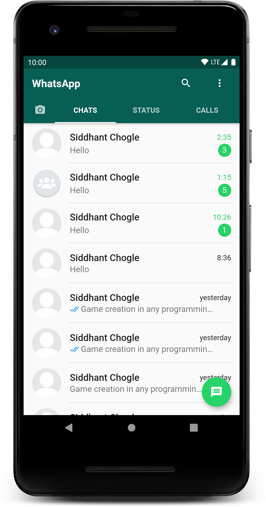
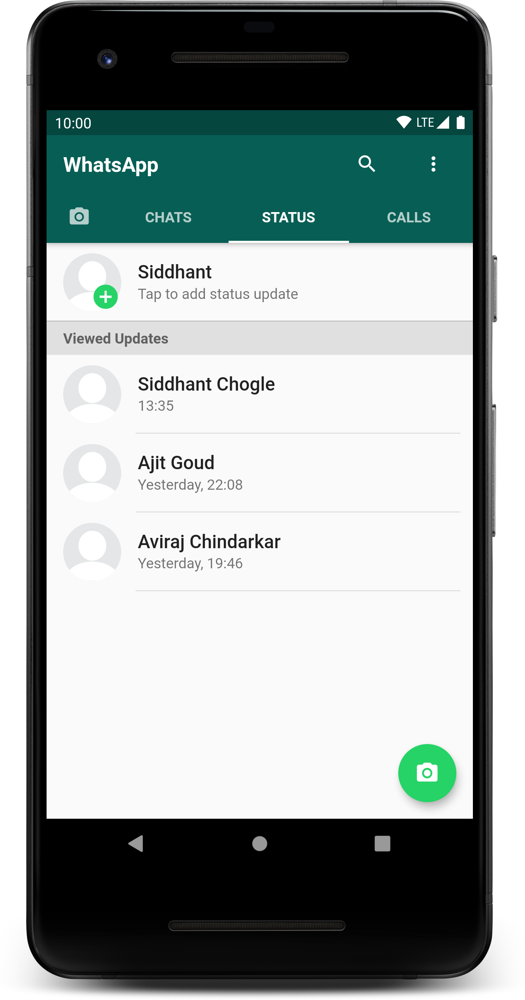
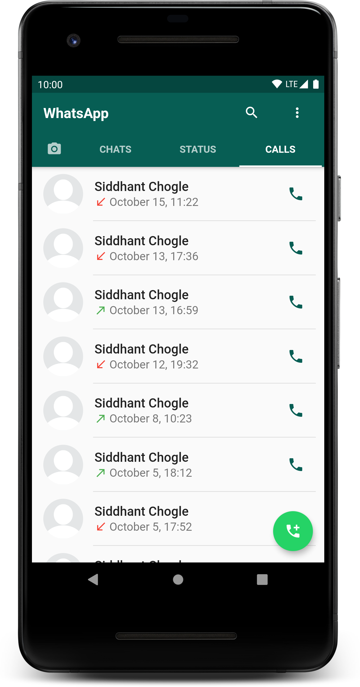

# WhatsApp Clone

This is one of my initial projects in flutter. The goal was to learn and practice the basics of flutter. I realised that **cloning** a software application is the best way to learn with motivation. A leap of faith!

## Description

Created the UI of most popular messaging app Whatsapp. Replicated the UI and some functionalities as close as possible.

## ScreenShots 📷

  

## Technology Stack and Others

- Flutter
- VS Code

## Resourses

- [Lab: Write your first Flutter app](https://flutter.dev/docs/get-started/codelab)
- [Cookbook: Useful Flutter samples](https://flutter.dev/docs/cookbook)
- [Online Documentation](https://flutter.dev/docs)

## My Notes

Tabbar -> \[Tabs], TabbarView\
**TODO:** UI fix, Story View

## Contributors

**Maintainer:** [Siddhant Chogle](https://github.com/SiddhantChogle)

## License

Project is published under the [MIT license](/LICENSE.md).

Feel free to ⭐ and fork Repo to modify/bug fix/improve the code as you want.
